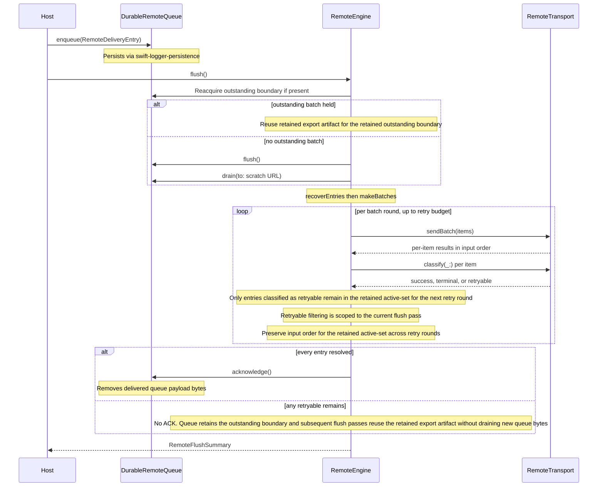

# swift-logger-remote

Durable remote delivery engine for [`swift-loggers`](https://github.com/swift-loggers/swift-logger).

The package owns the sink-neutral remote-delivery contract that
vendor-specific remote adapters (Elasticsearch, Splunk HEC, Loki,
Dynatrace Log Monitoring, Datadog Logs, …) build on top of, with
``RemoteTransport.sendBatch(_:)`` as the sole transport dispatch
primitive. It
depends on [`swift-logger-persistence`](https://github.com/swift-loggers/swift-logger-persistence)
at the released `0.1.x` SemVer line via
`.upToNextMinor(from: "0.1.0")` and consumes the byte-stable queue
export from the persistence layer exclusively through
``DurableRemoteQueue``. Destructive removal of delivered queue
payload bytes from the persistence layer runs only after the engine
acknowledges a non-empty flush pass whose recovered entries resolve as
`.success` or `.terminal` across the entire flush pass (LGR-11).

## Status

`0.1.0` establishes the public durable remote-delivery engine
surface for the `0.1.x` line. M3.4 is complete: the core contract
surfaces are locked, the persistence-backed
``DurableRemoteQueue`` core is in place, engine-internal
``BatchEngine`` machinery recovers entries from a drained queue
export and splits them into deterministic batches under
``RemoteBatchPolicy``, an engine-internal retry / execution loop
(``ExecutionLoop``) drives the per-entry retry budget for retained
active-set entries across batch rounds within the current flush pass
against
``RemoteTransport.sendBatch(_:)`` under
``RemoteRetryPolicy``, and the public
``RemoteEngine`` actor wraps that loop with the caller-driven
``flush()`` surface, the acknowledgement-to-removal lifecycle
closure for non-empty flush passes, and the
``RemoteTransport.classify(_:)`` sink-owned classification hook.
Concrete vendor adapters (Elastic `_bulk`, Splunk HEC, …) ship as
separate packages in later milestones.

## Installation

Add the dependency to your `Package.swift` and link `LoggerRemote`
to your target. The package pins to the `0.1.x` line via
`.upToNextMinor(from: "0.1.0")`.

```text
.package(
    url: "https://github.com/swift-loggers/swift-logger-remote.git",
    .upToNextMinor(from: "0.1.0")
)
```

```text
.target(
    name: "YourTarget",
    dependencies: [
        .product(name: "LoggerRemote", package: "swift-logger-remote")
    ]
)
```

## Queue envelope contract

``DurableRemoteQueue`` owns the persistence envelope `contentType`
as a queue-internal constant. Callers cannot customize it. The
engine-internal ``BatchEngine`` validates the envelope
`contentType` against the same constant before decoding any queue
records. A foreign envelope — one the queue did not produce for the
current queue-owned `contentType` — is refused fail-closed during
recovery rather than silently decoded as a malformed queue record.
`0.1.0` ships without a deprecated `contentType:` initializer
overload; the public API is locked around the queue-owned envelope
contract.

## Responsibilities

The package draws three sharp lines between collaborators:

- **Host application** owns the lifecycle trigger and the
  queue / export directories. It calls
  `DurableRemoteQueue.enqueue(_:)` with pre-encoded payload
  bytes and invokes `RemoteEngine.flush()` from its own lifecycle
  hooks (background notifications, shutdown signals, periodic
  tasks).
- **Adapter** owns vendor payload encoding before `enqueue` and
  implements `RemoteTransport.sendBatch(_:)` and
  `RemoteTransport.classify(_:)`. `sendBatch(_:)` receives one
  `RemoteTransportBatchItem` per entry the engine wants to dispatch
  in the round and returns one
  `Result<RemoteTransportResponse, any Error>` per input item, in
  the same order; adapters either loop per item internally (one
  vendor request per entry — Splunk HEC) or build one aggregating
  request carrying every item (Elastic `_bulk`). The adapter
  consults HTTP status, vendor body codes, or transport error types
  inside `classify(_:)` and maps each result to `.success` /
  `.terminal(reason:)` / `.retryable(reason:)` deterministically
  for the same transport result from the same adapter implementation
  within a flush pass. Returned result arrays preserve input order
  for retained active-set entries across retry rounds within the
  current flush pass. `classify(_:)` must not mutate acknowledgement
  or export-file lifecycle state directly or indirectly.
- **Engine** owns the durable queue drain, batching, per-entry
  retry budget, outstanding-batch reuse, and the
  acknowledgement-to-removal decision. The engine does **not**
  do vendor encoding or HTTP / wire-format parsing. The engine does
  not own autonomous scheduling or platform lifecycle observation.
  Internal retry-delay sleeps are limited to retry rounds within the
  current flush pass. No retry-delay state survives beyond the pass
  boundary. The engine lifecycle remains caller-driven outside
  internal retry-delay handling. Hosts own flush scheduling.

## Delivery Flow



## Usage

`RemoteDeliveryEntry.payload` is **opaque pre-encoded bytes** the
engine never decodes; the adapter (or the host upstream of
`enqueue`) encodes the entry into the vendor wire format before
`enqueue`. `metadata` is **per-entry sink-owned scratch space**,
opaque to the engine, that the engine propagates byte-for-byte through
`RemoteTransportBatchItem.payloadMetadata` to `sendBatch(_:)`.

### Custom transport

`RemoteTransport` is the sink-neutral seam adapters implement.
The example below shows the three-way classification surface
(`.success` / `.terminal` / `.retryable`) and where adapters
plug in vendor encoding and response inspection.

```swift
import Foundation
import LoggerRemote

/// Adapter-owned transport. Real adapters dispatch through
/// `URLSession` or a sink-specific HTTP client library inside
/// `sendBatch`, then consult HTTP status, vendor body codes,
/// or transport error types inside
/// `classify(_:)`. Adapters either loop per item internally (one
/// vendor request per entry — Splunk HEC) or build one aggregating
/// request carrying every item (Elastic `_bulk`) while preserving
/// one-result-per-input-item cardinality. In both cases, adapters
/// return one result per input item while preserving the result-array
/// ordering expected by `sendBatch(_:)` for the corresponding input
/// items. Returned result-array ordering for the retained active-set
/// remains stable across retry rounds within a flush pass.
/// This example dispatches per item and reads a sink-owned `"status"`
/// metadata entry to
/// demonstrate the three-way classification — real adapters branch
/// inside `classify(_:)` on whatever their wire format exposes.
struct ExampleTransport: RemoteTransport {
    func sendBatch(
        _ items: [RemoteTransportBatchItem]
    ) async throws -> [Result<RemoteTransportResponse, any Error>] {
        // Per-item loop: one vendor request per entry. Adapters
        // building an aggregating request (e.g. Elastic `_bulk`)
        // POST once and map each item-level response back into the
        // returned array, preserving `items` order.
        items.map { _ in
            .success(RemoteTransportResponse(
                responseBytes: Data(),
                responseMetadata: ["status": "ok"]
            ))
        }
    }

    func classify(
        _ result: Result<RemoteTransportResponse, any Error>
    ) async -> RemoteDeliveryResult {
        switch result {
        case let .success(response):
            // Adapters inspect their wire-format response here.
            // Real adapters branch inside `classify(_:)` on HTTP
            // status, item-level bulk-response arrays, or vendor
            // body codes. This example uses a sink-owned `"status"`
            // metadata entry to keep the snippet self-contained.
            switch response.responseMetadata["status"] {
            case "ok":
                // Vendor accepted the entry.
                return .success
            case "rejected":
                // Vendor permanently refused the entry (e.g. 4xx
                // client error, malformed event, schema violation).
                // The engine will not retry a terminal outcome.
                return .terminal(reason: .transportRejected)
            default:
                // Unknown / missing status — treat as transient
                // and let the retry budget cover it.
                return .retryable(reason: .transportRejected)
            }
        case .failure:
            // Transport-level failures (URLSession errors, DNS,
            // timeouts) are typically retryable. Adapter-specific
            // permanent failures (e.g. invalid credentials raised
            // as a custom error type) should be mapped to
            // `.terminal(reason:)` instead.
            return .retryable(reason: .transportRejected)
        }
    }
}
```

### Driving a flush

`flush()` returns a `RemoteFlushSummary` carrying
`attemptedBatches`, per-classification entry counts
(`succeededEntries` / `terminalEntries` / `retryableEntries`),
and a `RemoteFlushAcknowledgement` decision (`emptyReleased` /
`removedDeliveredBytes` / `notAcknowledged`). The host inspects
the summary to decide whether its own lifecycle hooks should schedule
another flush targeting the retained outstanding boundary. Retry
continuation uses the engine-internal outstanding-batch reuse path and
the retained export artifact without draining new queue bytes from
persistence.

```swift
import Foundation
import LoggerRemote

private struct AcceptingTransport: RemoteTransport {
    func sendBatch(
        _ items: [RemoteTransportBatchItem]
    ) async throws -> [Result<RemoteTransportResponse, any Error>] {
        items.map { _ in
            .success(RemoteTransportResponse(responseBytes: Data()))
        }
    }

    func classify(
        _ result: Result<RemoteTransportResponse, any Error>
    ) async -> RemoteDeliveryResult {
        switch result {
        case .success:
            return .success
        case .failure:
            return .retryable(reason: .transportRejected)
        }
    }
}

func runRemoteFlush() async throws {
    let temp = FileManager.default.temporaryDirectory
    let queueDirectory = temp.appendingPathComponent("queue-\(UUID())")
    let exportDirectory = temp.appendingPathComponent("exports-\(UUID())")
    try FileManager.default.createDirectory(
        at: queueDirectory, withIntermediateDirectories: true
    )
    try FileManager.default.createDirectory(
        at: exportDirectory, withIntermediateDirectories: true
    )
    // Snippet-local cleanup. Production hosts point
    // `queueDirectory` at a persistent location (e.g. an
    // `Application Support` subdirectory) and own the directory's
    // lifecycle across launches.
    defer {
        try? FileManager.default.removeItem(at: queueDirectory)
        try? FileManager.default.removeItem(at: exportDirectory)
    }

    let queue = DurableRemoteQueue(directory: queueDirectory)
    try await queue.enqueue(RemoteDeliveryEntry(
        identifier: 1,
        // Toy pre-encoded vendor payload — NOT a raw `LogRecord`.
        // Real adapters / hosts encode the entry into the vendor
        // wire format (one NDJSON line for Elastic `_bulk`, one
        // JSON event for Splunk HEC) before `enqueue`.
        payload: Data(#"{"event":"hello","level":"info"}"#.utf8),
        metadata: ["sink": "example"]
    ))

    let batchPolicy = try RemoteBatchPolicy.make(
        maxEntryCount: 100,
        maxByteCount: 64 * 1024
    )
    let retryPolicy = try RemoteRetryPolicy.make(
        maxAttempts: 3,
        backoff: .exponential(
            initialSeconds: 0.5, multiplier: 2, capSeconds: 8
        )
    )

    let engine = RemoteEngine(
        queue: queue,
        exportDirectory: exportDirectory,
        transport: AcceptingTransport(),
        batchPolicy: batchPolicy,
        retryPolicy: retryPolicy
    )

    let summary = try await engine.flush()
    switch summary.acknowledgement {
    case .emptyReleased:
        // The queue drained zero bytes; the empty boundary was
        // released and the engine reports zero per-class counts.
        break
    case .removedDeliveredBytes:
        // Every recovered entry resolved as `.success` or
        // `.terminal`; the persistence layer dropped the
        // delivered queue payload bytes.
        break
    case .notAcknowledged:
        // At least one entry exhausted the retry budget. The
        // queue still holds the outstanding-batch boundary and
        // the next `flush()` uses the engine-internal
        // outstanding-batch reuse path and the retained export
        // artifact without draining new queue bytes from persistence.
        break
    }
    if summary.retryableEntries > 0 {
        // Application-specific: schedule another `flush()` pass
        // from the next lifecycle hook so the retained artifact can
        // be reused through the outstanding-batch reuse path without
        // draining new queue bytes from persistence.
    }
}
```

## Non-goals

- No autonomous timer or scheduler in the public engine surface.
  The retry layer still performs internal retry-delay sleeps
  between retry rounds within the current flush pass. Those sleeps are
  engine-internal only. They never outlive the flush-pass
  boundary. The public engine lifecycle remains caller-driven outside
  internal retry-delay handling: hosts decide
  when to invoke
  ``RemoteEngine.flush()`` from their own lifecycle hooks
  (`UIApplication` background notifications, `NSWorkspace` power-off,
  shutdown signals, periodic tasks) or equivalent platform triggers.
  The public engine surface installs no platform lifecycle observer or
  autonomous scheduler. Hosts own lifecycle orchestration entirely.
- No concrete vendor adapter (Elastic `_bulk`, Splunk HEC, …) in
  this package. Concrete adapters ship separately on top of
  ``RemoteTransport.sendBatch(_:)``; tests use ``StubRemoteTransport``
  to exercise the same batch-round contract.
- Elastic-owned responsibilities: Elastic `_bulk` adapters own NDJSON
  construction, response parsing, and input-item correlation for
  per-item retry classification. The core engine ships no
  vendor-specific encoders, request builders, or response validators.
- No Datadog/Splunk/Loki/Dynatrace adapter packages here.
- No SDK-backed adapters (those bypass this engine by design).

## Documentation

- [`Docs/APIDesign.md`](Docs/APIDesign.md) — remote-delivery
  contract surface and sink-neutral ownership boundaries.
- [`Docs/Requirements.md`](Docs/Requirements.md) — `LGR-1 …` requirements
  catalog with milestone status.
